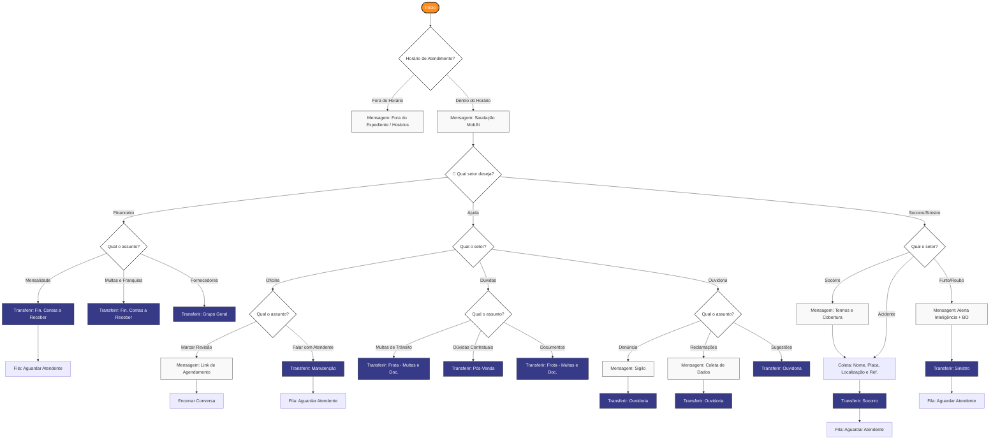

# Fluxo de Atendimento — WhatsApp (Bot de Triagem)

Bot de triagem para o canal WhatsApp Cloud API integrado ao Chatwoot.  
Construído no Typebot: https://bot.mobillirentals.com.br

---

## Diagrama

---

## Times Chatwoot mapeados

| Rota do bot | Team no Chatwoot |
|---|---|
| Financeiro → Mensalidade / Multas e Franquias | Fin. Contas a Receber |
| Financeiro → Fornecedores | Grupo Geral |
| Ajuda → Oficina → Atendente | Manutenção |
| Ajuda → Dúvidas → Multas de Trânsito / Documentos | Frota - Multas e Doc. |
| Ajuda → Dúvidas → Contratuais | Pós-Venda |
| Ajuda → Ouvidoria | Ouvidoria |
| Socorro / Acidente | Socorro |
| Furto / Roubo | Sinistro |

---

## Pendências

- [ ] Confirmar se todos os Times acima existem no Chatwoot
- [ ] Definir mensagem de fila de espera padrão (usada em todos os transfers)
- [ ] Definir coleta de nome: antes do menu ou por setor?
- [ ] Confirmar que Furto/Roubo não coleta dados antes de transferir
- [ ] Integrar Typebot ↔ Chatwoot via Agent Bot webhook
