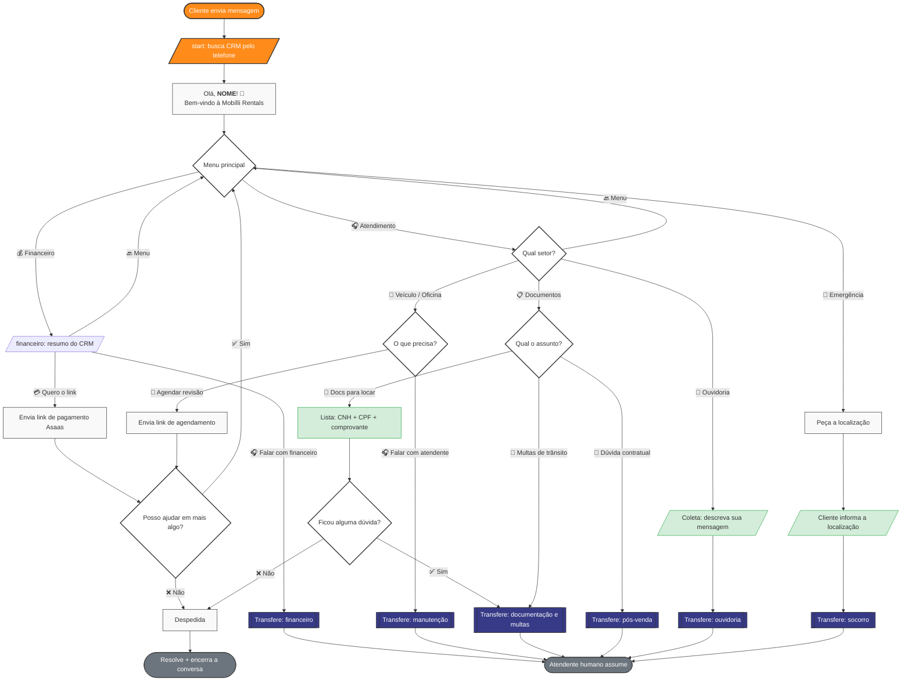

# Fluxo de Atendimento — WhatsApp (Bot de Triagem Mobílli)

Bot de triagem para o canal WhatsApp Cloud API integrado ao Chatwoot.

> **Motor:** máquina de estados nativa em Ruby — `BotFlow::Engine`
> ([`app/services/bot_flow/engine.rb`](../../app/services/bot_flow/engine.rb)).
> O Typebot foi **descontinuado** e removido. O webhook do Agent Bot chama
> `POST /webhooks/bot_flow` (com fallback legado `/webhooks/typebot`), que enfileira `BotFlow::ProcessEventJob` →
> `BotFlow::BridgeService` → `BotFlow::Engine.step`.

> **Horário de atendimento:** controlado nativamente pelo Chatwoot
> (Configurações → Horário de Funcionamento). O bot só é acionado dentro do horário.

---

## Diagrama do fluxo



---

## Estados do `BotFlow::Engine`

Cada estado é persistido em `conversation.additional_attributes['bot_state']`.
O cache do CRM da sessão fica em `['bot_crm']`.

| Estado | O que faz | Próximos estados |
|---|---|---|
| `start` | Busca o CRM pelo telefone, salva cache, saúda com o nome | `menu` |
| `menu` | Menu principal (3 botões) | `financeiro` · `atendimento` · `emergencia_menu` |
| `financeiro` | Mostra resumo financeiro do CRM + ações | `financeiro_link_enviado` · `atendente` · `menu` |
| `financeiro_link_enviado` | Após enviar o link: "mais alguma coisa?" | `menu` · `despedida` |
| `atendimento` | Escolha de setor (Veículo / Documentos / Ouvidoria) | `atendimento_veiculo` · `atendimento_documentos` · `atendimento_ouvidoria` · `menu` |
| `atendimento_veiculo` | Agendar revisão (self-service) ou falar com atendente | `pos_atendimento` · `atendente` · `menu` |
| `atendimento_documentos` | Docs para locar / Multas / Contrato | `documentos_duvida` · `atendente` · `menu` |
| `documentos_duvida` | Após listar os docs: "ficou dúvida?" | `atendente` · `despedida` |
| `atendimento_ouvidoria` | Coleta texto livre da manifestação | `atendente` |
| `pos_atendimento` | "Posso ajudar em mais algo?" (após self-service) | `menu` · `despedida` |
| `emergencia_menu` | Triagem de emergência (Roubo/Furto ou Socorro) | `emergencia` · `atendente` · `menu` |
| `emergencia` | Pede e coleta a localização do cliente (Socorro) | `atendente` |
| `atendente` | **Handoff** — bot fica em silêncio, humano assume | — (terminal) |
| `despedida` | Mensagem de encerramento + **resolve a conversa** + limpa a sessão | — (terminal, `end_session`) |

### Regra de handoff (`atendente`)

Ao transferir, o engine:
1. posta a mensagem de encaminhamento pro cliente;
2. faz `conversation.update!(status: :open, team_id: …)` — via `update!` (não `update_columns`)
   para disparar os callbacks do Chatwoot (`AssignmentHandler`): **round-robin** de agente
   (se o team tiver auto-atribuição ligada), atividade de mudança de time e broadcast pro dashboard.
   Se o nome do time não existir, a conversa é aberta sem atribuição e um warning é logado;
3. entra no estado `atendente`, no qual **ignora** novas mensagens do cliente
   (retorna `nil`) para não competir com o atendente humano.

Quando o cliente encerra pelo caminho `despedida`, o bot **resolve a conversa**
(`status: resolved`, via `BotFlow::BridgeService#resolve_conversation`) e limpa a
sessão (`bot_state`/`bot_crm`/`last_processed_message_id`); uma mensagem futura
recomeça no `start`. No **handoff** (`atendente`) quem resolve é o atendente humano —
o bot nunca resolve uma conversa que foi transferida.

---

## Regra de botões WhatsApp (máx. 3 por menu)

| Nível | Menu | Botões |
|---|---|---|
| 1 | Menu principal | 💰 Financeiro · 🎧 Atendimento · 🚨 Emergência |
| 2 | Financeiro (com atraso) | 💳 Quero o link · 🎧 Atendente · 🔙 Menu |
| 2 | Financeiro (em dia) | 💳 Quero o link · 🎧 Atendente · 🔙 Menu |
| 2 | Financeiro (sem cobrança) | 🎧 Atendente · 🔙 Menu |
| 2 | Atendimento | 🔧 Veículo · 📋 Documentos · 📣 Ouvidoria |
| 3 | Veículo | 📅 Agendar revisão · 🎧 Atendente |
| 3 | Documentos | 📄 Docs para locar · 🚦 Multas · 📝 Contrato |
| — | Ouvidoria / Emergência | texto livre (sem botões) |

> ⚠️ **Limite do WhatsApp:** título de botão ≤ **20 caracteres** (incluindo emoji). Acima
> disso o WhatsApp Cloud API **rejeita a mensagem interativa inteira** ("Falha ao enviar").
> Com ≤ 3 opções o Chatwoot manda como *botões* (limite 20 no título); com > 3, como *lista*
> (limite 24). Ver `Whatsapp::Providers::BaseService#create_buttons`.
>
> ⚠️ **Negrito:** as mensagens usam markdown padrão `**negrito**`. O Chatwoot renderiza via
> CommonMarker e converte `**x**` → `*x*` (negrito no WhatsApp). **Nunca** usar `*x*` isolado —
> o CommonMarker trata como ênfase e vira `_itálico_`. Ver `Messages::MarkdownRenderers::WhatsAppRenderer`.

---

## Times do Chatwoot (destino das transferências)

| Rota do bot | Team no Chatwoot |
|---|---|
| Financeiro → Falar com financeiro | `financeiro` (id 4) |
| Veículo/Oficina → Falar com atendente | `manutenção` (id 6) |
| Documentos → Docs (com dúvida) / Multas | `documentação e multas` (id 5) |
| Documentos → Dúvida contratual | `pós-venda` (id 1) |
| Ouvidoria | `ouvidoria` (id 7) |
| Emergência (localização) | `socorro` (id 3) |

> Nomes conferidos na VM (`Team.pluck(:id, :name)`). O time `monitoramento e sinistros`
> (id 2) existe mas não é usado — a emergência atual coleta só a localização e vai para `socorro`.
> A atribuição é case-insensitive (`LOWER(name)`); se um time for renomeado, atualizar aqui e no engine.

---

## Integração CRM — Autoatendimento

O bot consulta os dados reais do cliente no início do fluxo (`start`) via
[`Crm::ClientProfileService`](../../app/services/crm/client_profile_service.rb),
que cruza **Bitrix24** (contato, contrato, moto) + **Asaas** (cobranças).
O resultado é cacheado em `additional_attributes['bot_crm']` durante a sessão.

> Também exposto como endpoint proxy para integrações externas:
> `GET /webhooks/crm/client_profile?phone={E.164}&token={CRM_PROXY_TOKEN}`

### Campos retornados

| Campo | Descrição |
|---|---|
| `found` | `true` se o telefone bateu com um contato no Bitrix |
| `first_name` / `name` | Nome do cliente (usado na saudação) |
| `intro_message` | Resumo financeiro pronto (atraso / em dia / sem cobrança) |
| `payment_message` | Mensagem com o link Asaas da parcela (vencida ou próxima) |
| `overdue_count` / `overdue_total` | Nº e soma das parcelas vencidas |
| `next_payment` | Próxima parcela pendente (`value`, `due_date`, `invoice_url`) |
| `current_motorcycle_plate` / `_model` | Moto atualmente alugada |

### Situações do resumo financeiro (`intro_message`)

| Situação | Condição | Botões oferecidos |
|---|---|---|
| Com atraso | `overdue_count > 0` | 💳 Quero o link · 🎧 Falar com financeiro · 🔙 Menu |
| Em dia | `next_payment` presente | 💳 Link da próxima · 🎧 Falar com financeiro · 🔙 Menu |
| Sem cobrança | nada em aberto | 🎧 Falar com financeiro · 🔙 Menu |

---

## Deploy

O código roda em **dois containers** — ambos precisam da versão atualizada:

| Container | Papel |
|---|---|
| `chatwoot-rails-1` | Recebe o webhook e enfileira o job |
| `chatwoot-sidekiq-1` | Executa `Typebot::ProcessEventJob` (onde o engine roda de fato) |

```bash
# copiar o engine para os dois containers e reiniciar o sidekiq
docker cp app/services/bot_flow/engine.rb chatwoot-rails-1:/app/app/services/bot_flow/engine.rb
docker cp app/services/bot_flow/engine.rb chatwoot-sidekiq-1:/app/app/services/bot_flow/engine.rb
docker cp app/services/typebot/bridge_service.rb chatwoot-sidekiq-1:/app/app/services/typebot/bridge_service.rb
docker restart chatwoot-sidekiq-1
```

---

## Pendências

- [x] Substituir o Typebot por máquina de estados nativa (`BotFlow::Engine`)
- [x] Autoatendimento financeiro com dados reais (Bitrix + Asaas)
- [x] Saudação personalizada com o nome do CRM
- [x] Handoff dispara atribuição real (`update!` → round-robin/atividade/broadcast); teams conferidos na VM
- [x] Coleta de localização na Emergência: aceita o pin de localização do WhatsApp (attachment `location`), não só texto
- [ ] Ligar **auto-atribuição** (round-robin) nos teams que devem receber agente automático
