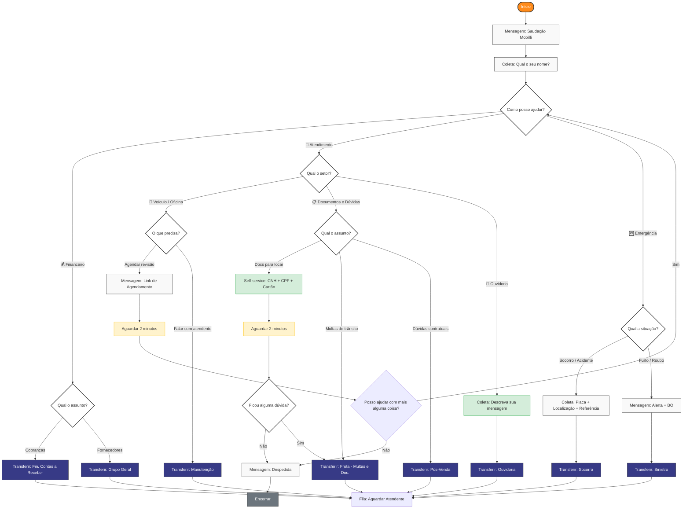
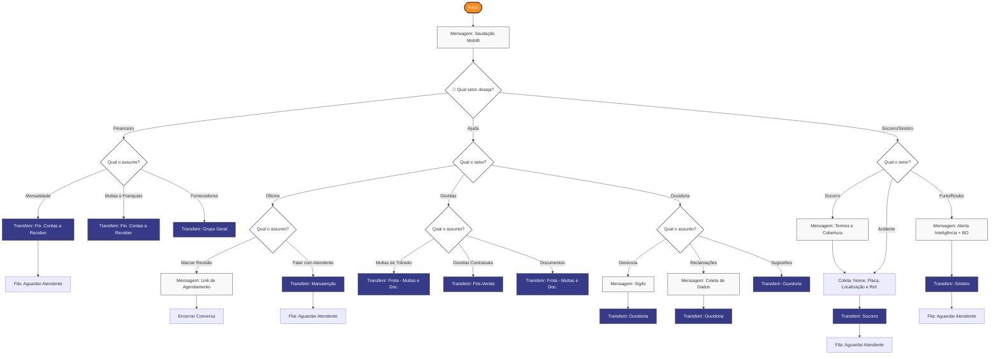

# Fluxo de Atendimento — WhatsApp (Bot de Triagem)

Bot de triagem para o canal WhatsApp Cloud API integrado ao Chatwoot.  
Construído no Typebot: https://bot.mobillirentals.com.br

---

## Fluxo v2 — Proposta Otimizada

### Mudanças em relação ao v1

| # | Problema | Solução |
|---|---|---|
| 1 | Até 4 níveis de menu antes do atendente | Máximo 2 níveis em qualquer caminho |
| 2 | "Ajuda" agrupa categorias sem relação | Substituído por "Veículo / Manutenção" e "Documentos e Contratos" |
| 3 | Sem coleta de nome | Nome coletado logo após a saudação |
| 4 | Tudo termina em transferência | Documentação e agendamento resolvidos sem atendente |
| 5 | Mensalidade e Multas/Franquias duplicadas | Unificadas em "Cobranças" (mesmo destino) |
| 6 | Ouvidoria com 3 sub-opções pro mesmo time | Campo de texto livre → transfer direto |



### Regra de botões WhatsApp

| Nível | Menu | Botões | OK? |
|---|---|---|---|
| 1 | Menu principal | 3 (Financeiro / Atendimento / Emergência) | ✅ |
| 2 | Financeiro | 2 (Cobranças / Fornecedores) | ✅ |
| 2 | Atendimento | 3 (Veículo / Documentos / Ouvidoria) | ✅ |
| 2 | Emergência | 2 (Socorro-Acidente / Furto-Roubo) | ✅ |
| 3 | Veículo | 2 (Agendar / Atendente) | ✅ |
| 3 | Documentos | 3 (Docs / Multas / Contrato) | ✅ |
| 3 | Ouvidoria | texto livre | ✅ |

---

## Fluxo v1 — Original

> **Nota:** O controle de horário de atendimento é gerenciado nativamente pelo Chatwoot  
> (Configurações → Horário de Funcionamento). O Typebot só é acionado dentro do horário.

## Diagrama

> **Nota:** O controle de horário de atendimento é gerenciado nativamente pelo Chatwoot  
> (Configurações → Horário de Funcionamento). O Typebot só é acionado dentro do horário.



---

## Times Chatwoot mapeados

| Rota do bot | Team no Chatwoot |
|---|---|
| Financeiro → Mensalidade / Multas e Franquias | Fin. Contas a Receber |
| Financeiro → Fornecedores | Grupo Geral |
| Ajuda → Oficina → Atendente | Manutenção |
| Ajuda → Dúvidas → Multas de Trânsito / Documentos | Frota - Multas e Doc. |
| Ajuda → Dúvidas → Contratuais | Pós-Venda |
| Ajuda → Ouvidoria | Ouvidoria |
| Socorro / Acidente | Socorro |
| Furto / Roubo | Sinistro |

---

---

## Integração CRM — Autoatendimento

O Typebot tem acesso a dados reais do cliente via um endpoint proxy no Chatwoot:

```
GET https://chat.mobillirentals.com.br/webhooks/crm/client_profile
    ?phone={{phoneNumber}}
    &token={{CRM_PROXY_TOKEN}}
```

### Resposta (JSON)

```json
{
  "found": true,
  "name": "WINSTON LUIZ LIMA DE ARAUJO",
  "first_name": "WINSTON",
  "cpf": "19077917799",
  "asaas_id": "cus_000173810998",
  "active_contract": true,
  "deal_id": "37536",
  "deal_start": "20/04/2026",
  "motorcycle_plate": "TOR8F68",
  "motorcycle_model": "GW12",
  "overdue_count": 2,
  "overdue_total": 552.00,
  "overdue_payments": [
    { "value": 276.0, "due_date": "10/05/2026", "invoice_url": "https://www.asaas.com/i/..." }
  ],
  "next_payment": { "value": 276.0, "due_date": "17/05/2026", "invoice_url": "https://..." }
}
```

### Casos de autoatendimento possíveis (sem humano)

| Pergunta do cliente | Variável usada | Resposta |
|---|---|---|
| "Quero pagar minha parcela" | `next_payment.invoice_url` | Link direto Asaas |
| "Tenho parcelas em atraso?" | `overdue_count`, `overdue_total` | "Sim, X parcela(s) — R$ Y" |
| "Qual minha moto?" | `motorcycle_plate`, `motorcycle_model` | "Placa TOR8F68 — GW12" |
| "Quando começou minha locação?" | `deal_start` | "20/04/2026" |
| "Estou em dia?" | `overdue_count == 0` | "Sim, você está em dia ✅" |

### Variáveis do Typebot

| Variável | Origem | Descrição |
|---|---|---|
| `phoneNumber` | `prefilledVariables` (Chatwoot) | Telefone do contato em formato E.164 |
| `conversationId` | `prefilledVariables` (Chatwoot) | ID da conversa no Chatwoot |
| `accountId` | `prefilledVariables` (Chatwoot) | ID da conta no Chatwoot |
| `chatwootToken` | `prefilledVariables` (Chatwoot) | Token do agent bot para webhooks |
| `clientName` | `prefilledVariables` (Chatwoot) | Nome do contato no Chatwoot |
| `crmData` | HTTP block (CRM proxy) | Objeto JSON com todos os dados do cliente |

---

## Pendências

- [x] Integrar Typebot ↔ Chatwoot via Agent Bot webhook
- [x] Confirmar que Furto/Roubo não coleta dados antes de transferir
- [ ] Implementar fluxo de autoatendimento financeiro no Typebot usando `crmData`
- [ ] Confirmar IDs dos times no Chatwoot (para os webhooks de assignment)
