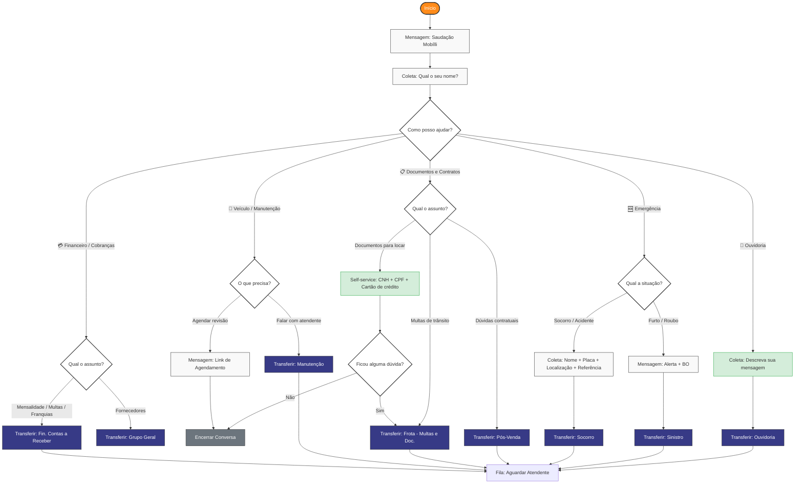

# Fluxo de Atendimento — WhatsApp (Bot de Triagem)

Bot de triagem para o canal WhatsApp Cloud API integrado ao Chatwoot.  
Construído no Typebot: https://bot.mobillirentals.com.br

---

## Fluxo v2 — Proposta Otimizada

### Mudanças em relação ao v1

| # | Problema | Solução |
|---|---|---|
| 1 | Até 4 níveis de menu antes do atendente | Máximo 2 níveis em qualquer caminho |
| 2 | "Ajuda" agrupa categorias sem relação | Substituído por "Veículo / Manutenção" e "Documentos e Contratos" |
| 3 | Sem coleta de nome | Nome coletado logo após a saudação |
| 4 | Tudo termina em transferência | Documentação e agendamento resolvidos sem atendente |
| 5 | Mensalidade e Multas/Franquias duplicadas | Unificadas em "Cobranças" (mesmo destino) |
| 6 | Ouvidoria com 3 sub-opções pro mesmo time | Campo de texto livre → transfer direto |

---

## Fluxo v1 — Original

> **Nota:** O controle de horário de atendimento é gerenciado nativamente pelo Chatwoot  
> (Configurações → Horário de Funcionamento). O Typebot só é acionado dentro do horário.

## Diagrama

> **Nota:** O controle de horário de atendimento é gerenciado nativamente pelo Chatwoot  
> (Configurações → Horário de Funcionamento). O Typebot só é acionado dentro do horário.

---

## Times Chatwoot mapeados

| Rota do bot | Team no Chatwoot |
|---|---|
| Financeiro → Mensalidade / Multas e Franquias | Fin. Contas a Receber |
| Financeiro → Fornecedores | Grupo Geral |
| Ajuda → Oficina → Atendente | Manutenção |
| Ajuda → Dúvidas → Multas de Trânsito / Documentos | Frota - Multas e Doc. |
| Ajuda → Dúvidas → Contratuais | Pós-Venda |
| Ajuda → Ouvidoria | Ouvidoria |
| Socorro / Acidente | Socorro |
| Furto / Roubo | Sinistro |

---

## Pendências

- [ ] Confirmar se todos os Times acima existem no Chatwoot
- [ ] Definir mensagem de fila de espera padrão (usada em todos os transfers)
- [ ] Definir coleta de nome: antes do menu ou por setor?
- [ ] Confirmar que Furto/Roubo não coleta dados antes de transferir
- [ ] Integrar Typebot ↔ Chatwoot via Agent Bot webhook
